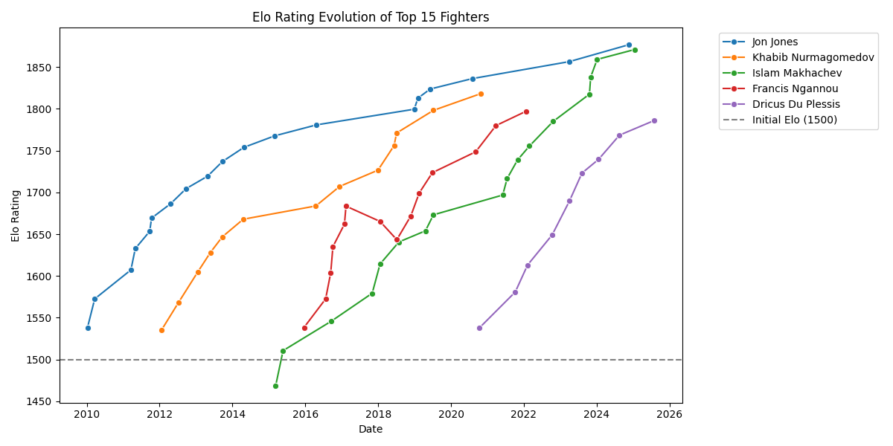
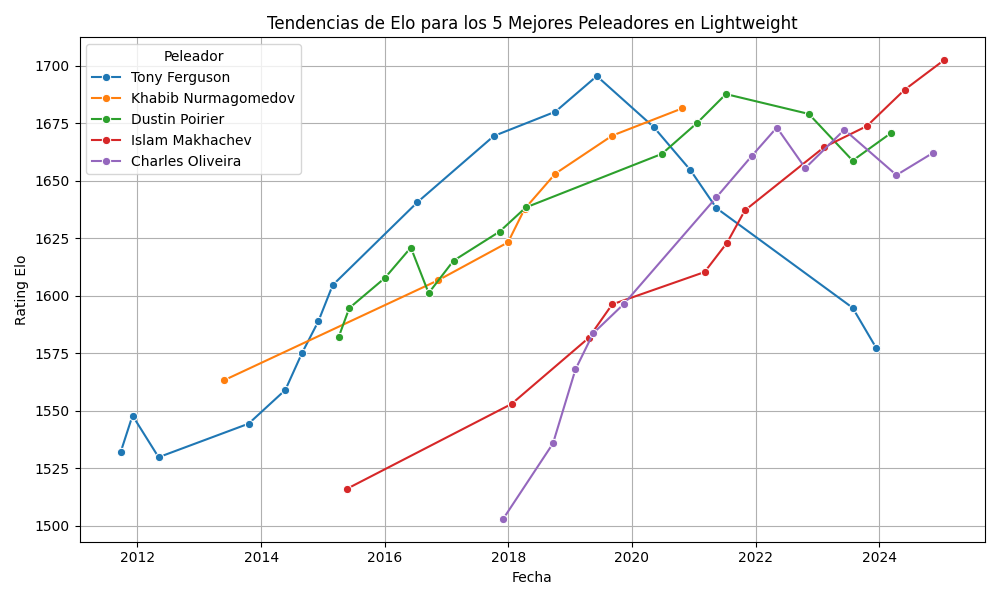
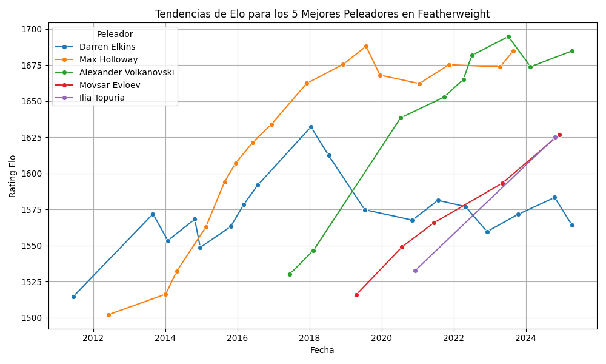
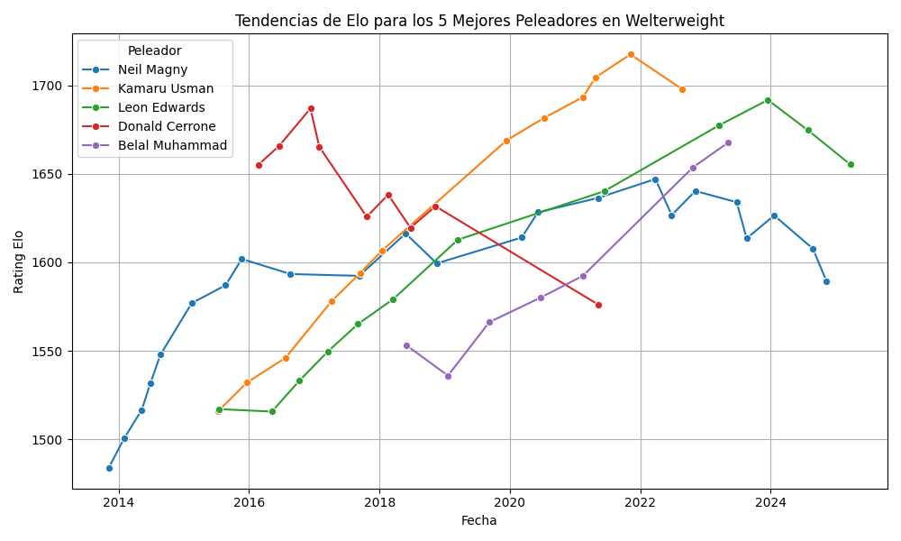

# Proyecto UFC Elo Rating

Este repositorio contiene scripts en Python para calcular las clasificaciones Elo de los peleadores de UFC basadas en los resultados de sus peleas. El proyecto incluye dos scripts principales: uno para una clasificación Elo global de todos los peleadores y otro para clasificaciones Elo específicas por división.

## Descripción General

El sistema Elo es un método para calcular los niveles de habilidad relativa de los participantes en juegos de dos jugadores, como el ajedrez o, en este caso, peleas de MMA. Este proyecto aplica el sistema Elo a datos de peleas de UFC para clasificar a los peleadores según su desempeño.

- **Fuente de Datos**: Los scripts utilizan un archivo CSV (`ufc_fight_data.csv`) que contiene datos de peleas con columnas como `RedFighter`, `BlueFighter`, `Winner`, `Method`, `Date` y `WeightClass`.
- **Requisitos**: Python 3.x con las siguientes bibliotecas: `pandas`, `matplotlib`, `seaborn`.

## Fórmula del Elo

Utilizamos una implementación estándar del sistema Elo para actualizar las clasificaciones después de cada pelea. La fórmula básica para actualizar el Elo de un peleador \( R_A \) después de enfrentarse a un oponente \( R_B \) es la siguiente:

\[ R_A' = R_A + K \times (S_A - E_A) \]

Donde:
- \( R_A' \): Nueva clasificación Elo de \( A \).
- \( R_A \): Clasificación Elo actual de \( A \).
- \( K \): Factor de ajuste (explicado más adelante).
- \( S_A \): Resultado real (1 si \( A \) gana, 0 si pierde, 0.5 si es empate).
- \( E_A \): Resultado esperado, calculado como:

\[ E_A = \frac{1}{1 + 10^{(R_B - R_A)/400}} \]

Esto significa que si un peleador con un Elo mucho más alto que su oponente gana, su Elo subirá poco porque se esperaba que ganara. Pero si un peleador con un Elo más bajo gana, su Elo subirá más significativamente.

### Factores K Según el Método de Finalización

El valor de \( K \) determina cuánto cambia el Elo después de una pelea. Lo ajustamos según el método de finalización para reflejar la importancia del resultado:

- **Base K = 32**: Valor estándar para peleas decididas por decisión.
- **KO/TKO o SUB (Knockout/Técnico o Sumisión)**: Multiplicamos \( K \) por 1.2 (\( K = 32 \times 1.2 = 38.4 \)), porque una victoria contundente por KO o sumisión tiene más peso.
- **U-DEC (Decisión Unánime)**: Multiplicamos \( K \) por 0.9 (\( K = 32 \times 0.9 = 28.8 \)), ya que es una victoria menos dominante.
- **S-DEC (Decisión Dividida)**: Multiplicamos \( K \) por 0.7 (\( K = 32 \times 0.7 = 22.4 \)), porque el resultado es más ajustado.
- **M-DEC (Decisión Mayoritaria)**: Multiplicamos \( K \) por 0.8 (\( K = 32 \times 0.8 = 25.6 \)).
- **DQ (Descalificación)**: Multiplicamos \( K \) por 0.5 (\( K = 32 \times 0.5 = 16 \)), ya que estas victorias son menos representativas.
- **OVERTURNED (Resultado Anulado)**: \( K = 0 \), no se ajusta el Elo.

Estos ajustes reflejan que un KO o una sumisión son victorias más impresionantes que una decisión dividida o una descalificación.

## Scripts

### 1. `elocalculator.py` (Elo Global)

- **Propósito**: Calcula una única clasificación Elo para cada peleador, sin importar la división en la que pelee.
- **Características**:
  - Procesa los resultados de las peleas cronológicamente para actualizar los puntajes Elo.
  - Inicializa el Elo de cada peleador en 1500.
  - Ajusta el Elo según victorias, derrotas o empates, usando los factores K mencionados.
- **Salida**: Imprime los mejores peleadores por Elo y puede extenderse para generar visualizaciones (por ejemplo, tendencias de Elo a lo largo del tiempo).
- **Uso**:
  ```bash
  python elocalculator.py´´´
- **Notas**: Este script considera todas las peleas como si fueran en un solo contexto, ignorando las diferencias entre divisiones.

### 2. `elo_per_division.py` (Elo por División)

- **Propósito**: Calcula clasificaciones Elo separadas para cada peleador en cada división (por ejemplo, Featherweight, Lightweight).
- **Características**:
  - Mantiene un Elo independiente por división para cada peleador.
  - Si un peleador entra a una nueva división, su Elo inicial se calcula como el promedio de sus Elo en otras divisiones (explicado más adelante).
  - Guarda las clasificaciones finales en `elo_per_division.csv`.
  - Genera visualizaciones de tendencias para los 5 mejores peleadores en cada división como archivos PNG (por ejemplo, `elo_trends_lightweight.png`).
- **Salida**:
  - `elo_per_division.csv`: Contiene las columnas `fighter`, `division` y `elo`.
  - Visualizaciones: Un gráfico por división mostrando las tendencias de Elo a lo largo del tiempo.
- **Uso**:
  ```bash
  python elo_per_division.py´´´
- **Notas**: Este script es útil para analizar el desempeño dentro de divisiones específicas y maneja casos de peleadores que compiten en múltiples categorías.
### Consideración para Cambios de Categoría (Ejemplo: Conor McGregor)

Cuando un peleador cambia de división (por ejemplo, Conor McGregor pasando de peso pluma a peso ligero), no queremos que su Elo inicial en la nueva división sea 1500, ya que esto ignoraría su trayectoria y habilidad demostrada. En cambio, tomamos el promedio de sus Elo en las divisiones donde ya ha peleado.

**Ejemplo con Conor McGregor**:
- Supongamos que McGregor tiene un Elo de 1800 en peso pluma (Featherweight) después de varias peleas exitosas.
- Luego, decide subir a peso ligero (Lightweight) para su próxima pelea.
- En lugar de inicializar su Elo en 1500 en peso ligero, calculamos el promedio de sus Elo existentes:
  - Solo ha peleado en peso pluma, donde su Elo es 1800.
  - Promedio = 1800.
- Por lo tanto, McGregor comienza con un Elo de 1800 en peso ligero, y este puntaje se ajustará según sus resultados en esa división.

Este enfoque asegura que la habilidad general de un peleador se refleje al cambiar de división, pero aún permite que su Elo evolucione según su desempeño en el nuevo contexto.

## Visualización de Tendencias Elo Global

    
## Visualizaciones de Tendencias por División

El script `elo_per_division.py` genera gráficos que muestran las tendencias de Elo para los 5 mejores peleadores en cada división. A continuación, se presentan algunos ejemplos:


- **Tendencias en Peso Ligero (Lightweight):**
  

- **Tendencias en Peso Pluma (Featherweight):**
  

- **Tendencias en Peso Welter (Welterweight):**
  

*Nota: Las imágenes se generan automáticamente al ejecutar el script y reflejan los datos más recientes del dataset.*